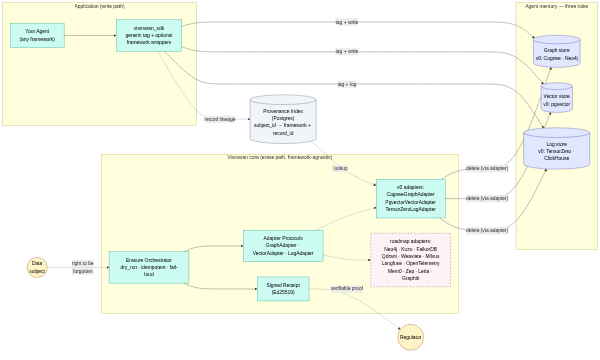
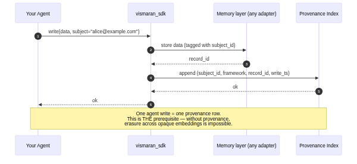
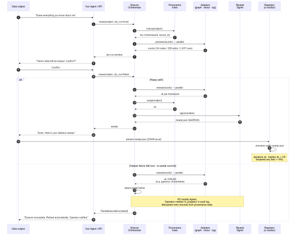
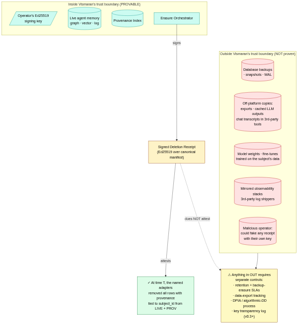
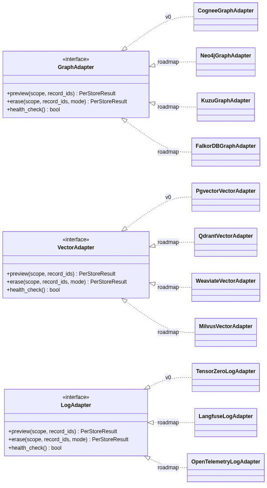

# Vismaran

> **विस्मरण** (Sanskrit / Hindi: *forgetting*, *oblivion*)
>
> Provable right-to-be-forgotten for AI agent memory — graph, vector, and inference log — with a signed deletion receipt a regulator can verify offline.

[](#status) [](LICENSE) [](pyproject.toml)

## Why this exists

India's **DPDP Rules** take full effect **13 May 2027** (no grace period). GDPR **Article 17** is the parallel global obligation. Both require, in plain language: a user can demand to be forgotten, you have a clock to do it, the obligation extends to your processors, and you must keep a record proving you did.

A production AI agent's memory of a single person isn't in one place — it's smeared across **three layers**:

- **Graph** — structured knowledge-graph memory (entities, relationships, claims). v0 targets [Cognee](https://github.com/topoteretes/cognee) (fronts Neo4j / Kuzu / FalkorDB).
- **Vector** — embeddings whose source text mentions the subject. v0 targets [pgvector](https://github.com/pgvector/pgvector).
- **Log** — the inference + feedback log a self-improvement loop trains on. v0 targets [TensorZero](https://github.com/tensorzero/tensorzero) (fronts ClickHouse).

Honoring an Article 17 request means erasing across **all three**, and proving you did. Nobody has built a clean OSS solution. Vismaran is that solution.

## Status

**v0.1 alpha — active development.** The full erase path is in: all three v0 store adapters — Cognee (graph), pgvector (vector), TensorZero (log) — behind an orchestrator that fans out across them in parallel, purges the provenance ledger, and on full success emits a signed Ed25519 deletion receipt (canonical-JSON, tamper-evident, verifiable offline) — fail-loud (no partial-commit receipt) and idempotent. 106 tests pass on every PR — 63 unit + 43 integration against live Postgres + Neo4j + ClickHouse. The `vismaran` CLI (keygen / erase / verify) that wraps this for operators is next. Legend: ✅ shipped · 🚧 next · 📋 planned.

| Capability | v0.1 | Roadmap |
|---|:-:|:-:|
| `vismaran_sdk.tag` — contextvar subject propagation across async tasks | ✅ | |
| `ProvenanceIndex` — Postgres-backed `(subject, framework, record_id, ts)` ledger | ✅ | |
| CogneeGraphAdapter — tier-3 Cypher delete via NodeSet `subject::<id>` (the wedge) | ✅ | |
| `vismaran_sdk.cognee_wrap.add` — subject tagging at ingest + provenance recording | ✅ | |
| Cognee tier-1 (user-scope `cognee.forget(user=)`) + tier-2 (dataset-scope) | | v0.2 |
| PgvectorVectorAdapter — lineage-driven embedding deletion | ✅ | |
| TensorZeroLogAdapter — 7 ClickHouse tables, ModelInference cascade by `inference_id` | ✅ | |
| `vismaran_sdk.tensorzero_wrap` — `vismaran::subject_id` tag injection on inference + feedback | 📋 | |
| Erasure Orchestrator — parallel fan-out, dry-run preview, fail-loud, idempotent | ✅ | |
| Signed receipt — Ed25519 over a canonical-JSON manifest, tamper-evident, offline-verifiable | ✅ | |
| `vismaran` CLI — `keygen` / `erase` / `verify` subcommands | 🚧 | |
| FastAPI + HTMX demo (Cognee + pgvector + TensorZero) | 📋 | |
| Crypto-shred mode | | v0.2 |
| Anonymize-partial-subject (graph) — re-embed redacted chunks | | v0.2 |
| Kuzu / FalkorDB / Neptune graph backends | | v0.2 |
| Mem0 / Zep / Graphiti / Letta adapters | | v0.3 |
| Qdrant / Weaviate / Milvus vector | | v0.3 |
| CopilotKit / Langfuse / OpenTelemetry log adapters | | v0.3 |
| TypeScript client | | v0.3 |
| Hosted Vismaran | | TBD |
| Backup-erasure | | non-v0 |

Honest about scope: **both Cognee and TensorZero have zero open GDPR/RTBF issues today** (verified 2026-05-27). Vismaran exists because that gap is real.

## Architecture

Five diagrams. Mermaid sources live in [`docs/architecture/`](docs/architecture/); the PNGs below are checked-in renderings. Full design + DPDP / GDPR Article 17 clause mapping is in [`SPEC.md`](SPEC.md).

### 1. Component overview

What plugs into what: write path (your agent → `vismaran_sdk` → memory layers + provenance index) and erase path (data subject → Erasure Orchestrator → adapter fan-out → signed receipt → regulator). Framework-agnostic at the protocol level; v0 ships three concrete adapters.



Source: [`1-component.mmd`](docs/architecture/1-component.mmd)

### 2. Ingest flow

The provenance contract in one sequence diagram. **One agent write = one provenance row.** Without this, erasure across opaque embeddings is impossible.



Source: [`2-ingest.mmd`](docs/architecture/2-ingest.mmd)

### 3. Erasure flow

Happy path (dry-run → confirm → parallel adapter erase → signed receipt → regulator verifies offline) and the failure path (fail-loud, no partial-commit receipt, idempotent retry).



Source: [`3-erasure.mmd`](docs/architecture/3-erasure.mmd)

### 4. Threat model

What the receipt provably attests (everything inside Vismaran's trust boundary) vs. what it doesn't (backups, off-platform copies, fine-tunes that already trained on the subject's data, mirrored observability, malicious operator). Anything outside the boundary needs separate controls.



Source: [`4-threat.mmd`](docs/architecture/4-threat.mmd)

### 5. Adapter protocol

The three interfaces (`GraphAdapter`, `VectorAdapter`, `LogAdapter`) and their v0 + roadmap implementations.



Source: [`5-adapter.mmd`](docs/architecture/5-adapter.mmd)

## Quickstart (target — end-to-end flow lands with the demo milestone)

```bash
# clone
git clone https://github.com/sambhal-labs/vismaran && cd vismaran

# bring up the stack: neo4j + postgres+pgvector + clickhouse + tensorzero gateway
docker compose up -d

# install + seed Alice/Bob/Carol across all 3 layers
uv sync --extra all --extra demo
make seed

# preview what would be erased
uv run vismaran erase --subject alice@example.com --dry-run

# do it for real → writes receipt.json
uv run vismaran erase --subject alice@example.com

# verify the receipt offline (regulator-grade proof)
uv run vismaran verify receipt.json
```

Until the orchestrator and receipt signer land, `uv run vismaran` prints "not implemented yet" for the erase/verify subcommands.

## Provenance contract (the only thing your agent has to do)

You can't erase what you didn't trace. Vismaran's SDK gives you 1-line drop-in wrappers:

```python
from vismaran_sdk.tag import with_subject
from vismaran_sdk.cognee_wrap import add as cognee_add
from vismaran_sdk.tensorzero_wrap import inference as tz_inference

async with with_subject("alice@example.com"):
    await cognee_add(text="...")             # tags + records provenance
    await tz_inference(function_name="chat", input=...)  # tags inference with vismaran::subject_id
```

The tag prefix `vismaran::` is namespaced specifically because TensorZero reserves `tensorzero::` — see [`docs/architecture/`](docs/architecture/).

## Discussion welcome

- "Why do you need *another* memory tool?" — Open an issue. Short answer: this isn't memory tooling, it's compliance-grade erasure infrastructure. We don't store your data; we erase from where you do.
- "When is the [Mem0 / Zep / Graphiti / Qdrant / your-framework] adapter landing?" — Track [`Adapter requests`](https://github.com/sambhal-labs/vismaran/discussions) (after the launch).
- "Will Vismaran ever be hosted?" — TBD. v0 is OSS-only. We'll let inbound demand decide.
